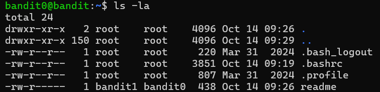
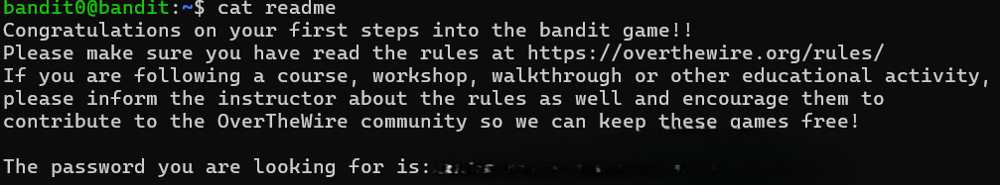

# OVERTHEWIRE-BANDIT0->1:

Username: bandit0

password: <Redacted>(obtain it from the website)

#### Prerequisites:

ls command: ls stands for list, and what it does is list all files and directories in the current directory(think of a directory as a folder). Commonly, it is used with both the -l and -a flags. The -l allows you to see some of the details of the files, and -a allows you to see hidden files and directories(they start with a "."). The syntax for adding these two flags is simply -la. 

cat command: The cat command prints the content of a file or files. Its syntax is cat followed by the file name/address.

#### Solving the level:

This is a continuation of the previous level, so I will start where we left off.

The website tells us that there is a file called readme with the password inside in the home directory(the directory you start in). We could just cat it, but let us use ls -la to get accustomed to it.

Now we can cat the readme file.

Make sure to save the password in your notes app or anywhere else so that you don't lose your progress!

Next Level: [Bandit1->2](bandit1/writeup.md.md)

