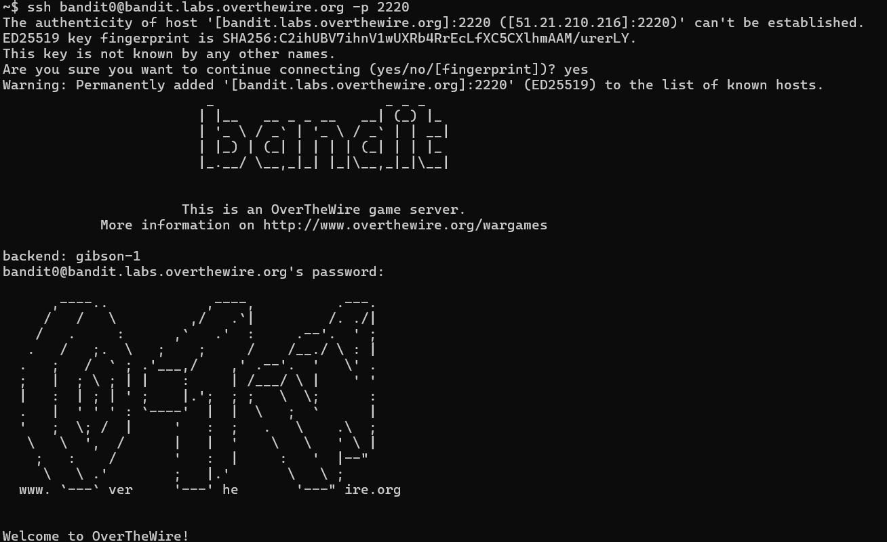

# OVERTHEWIRE-BANDIT0:

Username: bandit0

password: <Redacted>(obtain it from the website)

#### 

#### Prerequisites:

**SSH command:** The SSH command enables an SSH connection to be established with another computer. SSH is short for Secure Shell; as the name suggests, the connection is encrypted and protects against eavesdropping.

 

Syntax- *ssh username@computerIwanttologinto.org*

For OverTheWire, you will need to know how to specify the port. To do that, add the -p flag (a flag is a hyphen followed by a letter to signify a change in the command's parameters/function).

**WSL/VM/Ubuntu/Linux:** To run Linux, you will need either a WSL, VM, or Linux operating system. Below are explanations of their differences and links to videos highlighting how to install them. It is normal if you encounter many problems while trying to install. If you do encounter one, I recommend consulting ChatGPT, but definitely try to solve the problem, as it will get you more acquainted with errors and bugs that could occur in any system. If at any point you try to run a command using one of these but it doesn't work, also ask ChatGPT, you may need to install a package(group of commands).

WSL: Abbreviation of Windows Subsystem for Linux, which allows you to run the Linux terminal in your own terminal and access your own Windows files, although that does require slightly different syntax. Thankfully, you won't have to worry about that until OverTheWire Leviathan. I would recommend installing Ubuntu as it's the most beginner-friendly Linux system.

WSL link: [click here](https://www.youtube.com/watch?v=wz0QBNy9i7w)
(you only need to watch up until about 2 mins)

VM: A VM is short for Virtual Machine. It simulates the Linux operating system and requires you to allocate resources to it. It can be quite inconvenient to use a VM for Bandit, although I would recommend it for Leviathan later. The freedom a VM provides isn't really beginner-friendly, but it can be nice to try it out. I would recommend installing Ubuntu along with the VM as the OS of choice.

VM link:  [click here](https://www.youtube.com/watch?v=YjG1yG2l9v0)

Ubuntu: Ubuntu is a type of Linux system that is very beginner-friendly and easy to use. It can even be installed in the Microsoft Store, and so this method is the simplest and fastest way to start Bandit. I recommend this, and I will personally be using it while doing Bandit.

Ubuntu: As I mentioned, just go to the Microsoft store :).

Linux: The Linux operating system is what allows us to use a bash script to solve Bandit and all other OverTheWire wargames. I would heavily advise against uninstalling Windows to install Linux, but you could also choose to dual-boot, although I still don't recommend doing this until you have a good grasp of what you can do with Linux. You may find the tutorials confusing; if you do, you probably don't have enough experience and should just stick to one of the other methods.

Installing Linux OS: [click here](https://www.youtube.com/watch?v=n8vmXvoVjZw&t=732s)

Installing Linux OS to Dual-Boot: [click here](https://www.youtube.com/watch?v=CWQMYN12QD0)

#### Solving the level:

Open the Ubuntu shell and run the command: *ssh bandit0@bandit.labs.overthewire.org -p 2220*

Afterwards, it will ask you for a password. Enter the password from the website.

Side Note: I have hidden my username so only ~$ will appear before the command on my screen; it's fine if your username appears.

Next Level: [Bandit0->1](../Bandit0-1/writeup.md.md)

