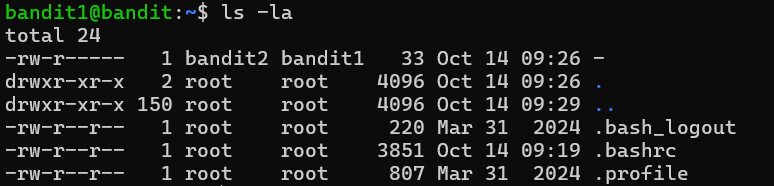
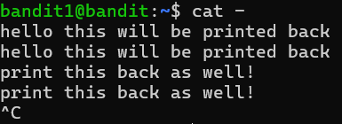

# OVERTHEWIRE-BANDIT1->2:

Username: bandit1

what the username means: in the ssh we previously did bandit0@... now we have to do bandit1@...

password: <Redacted>(obtain it from previous level)

#### Prerequisites:

**Understanding of a literal file path**: let's say you have a filename with a space or a filename that starts with an unusual character, you should add a dot-slash (./) to make it literal. The dot points to the current directory, and the / indicates it is pointing to the location followed by it in the current directory.

#### Solving the level: 

After logging in, let us do an ls -la

As the website said, the is a file named - with the password we want, let us try to cat it without specifying the path. As expected, it didn't work because Linux thought it was the stdin flag for cat(this flag means whatever you type next will be printed back). Use control-c to cancel the command 

Now run **cat ./-** and you should get the password

Previous level: [Bandit0->1](../Bandit0-1/writeup.md.md)

Next Level: [Bandit2->3](../Bandit2/writeup.md.md)

