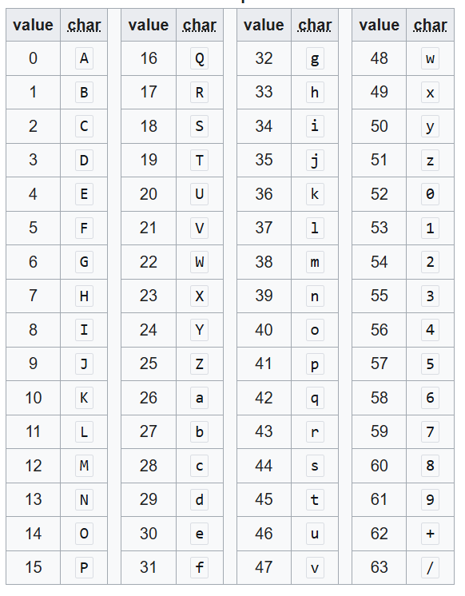
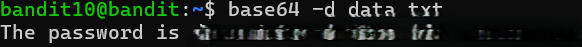

# OVERTHEWIRE-BANDIT10->11:

Username: bandit10

password: <Redacted>(obtain it from previous level)

#### Prerequisites:

Base64 knowledge: Base64 is an alphabet with 64 values and is often used to encode info. The alphabet is down below:

See it and other info from [Wikipedia](https://en.wikipedia.org/wiki/Base64).

base64 command: the base64 command encodes a text into base64.

syntax- base64 (flag) filename

base64 -d flag: decodes a text from base64

#### Solving the level: 

Just run base64 -d on the file:

Previous level: [Bandit9->10](../Bandit9/writeup.md.md)

Next Level: [Bandit11->12](../Bandit11/writeup.md.md)

