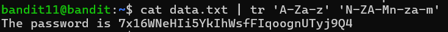
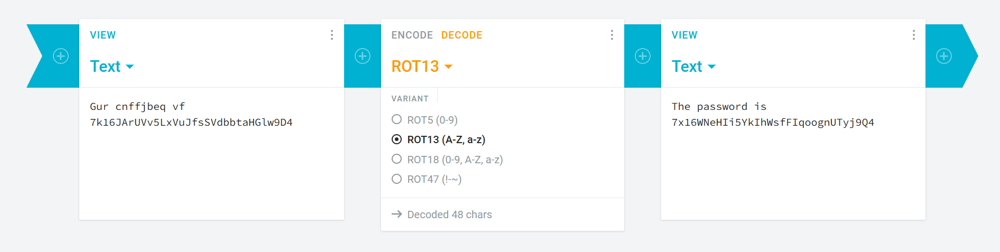

# OVERTHEWIRE-BANDIT11->12:

Username: bandit11

password: <Redacted>(obtain it from previous level)

#### Prerequisites:

Rot13: Rot13 is a standard cipher in which all letters of the alphabet are rotated 13 letters. For example, a would become n and b would become o. More info at [Wikipedia.com](https://en.wikipedia.org/wiki/ROT13).

tr command: The tr command stands for translate, and it changes letters around based on the parameters. Example: 'A-Z' 'a-z' would convert all letters from uppercase to lowercase. More examples would probably help: [Examples](https://www.geeksforgeeks.org/linux-unix/tr-command-in-unix-linux-with-examples/). There is no parameter to select a file, so you must either cat or echo(print in other languages) and then pipe to tr.

cipher decoder: There are many cipher decoders online that can decode most ciphers. One example would be [Cryptii](https://cryptii.com/) or [dCode](https://www.dcode.fr/en), and you can use them to solve this level, although it is better if you experiment with tr. Still, these decoders will probably be useful, especially later in Krypton.

#### Solving the level:

So the intentional way to solve this is to do a cat pipe to a tr:

But we can also use Cryptii:

Previous level: [Bandit10->11](../Bandit10/writeup.md.md)

Next Level:[Bandit12->13](../Bandit12/writeup.md.md)

