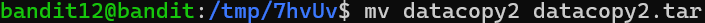

# OVERTHEWIRE-BANDIT12->13:

Username: bandit12

password: <Redacted>(obtain it from previous level)

#### Prerequisites:

There are many ways to solve this level, and you probably should know all of them, so there are a lot of commands.

**/tmp directory**: the temporary directory is present in most Linux systems; sometimes it is restricted, but in Overtherwire, you can access it no matter which user you are. The temporary directory is unique because it is wiped at reboot.

**mkdir command**: This command allows you to make a directory; it stands for "make directory". Syntax- mkdir newdirpath (make sure to make it in /tmp)

**mktemp command**: This command allows you to make a temporary file with a random name; it stands for "make temporary". The length of the random name depends on how many Xs you have in the name. Ex. mktemp /tmp/XXXXX. If you use the -d flag, it creates a random-named directory instead.

**cp command**: This command allows you to copy files to other files. syntax- cp filetobecopiedpath targetfilepath. The target file does not have to exist to copy the file to it. If you are copying a file from one directory to another, you must use the full path of the file in the directory you are not in.

**touch command**: This command allows you to create a file. You don't need it for this level, but it might help. Syntax- touch filename

**mv command**: This command stands for move. You can move a file's info to another file with a different name, and it deletes the previous file. Ex. mv data data.txt data is deleted, data.txt is created with data's info. This is important because data.txt is now a text file. This is important for some of the commands below that depend on the ending suffix. 

**xxd command**: The xxd command allows you to make a hexdump, which is a hexadecimal representation of all the data in a file. the -r flag allows you to reverse a hex dump. syntax- xxd (flags) targetfile

**file command**: The file command allows you to view the properties of a file. If it is compressed, it will show you what type of compression it is. syntax- file targetfile

**rm command**: stands for remove, allows you to delete a file. syntax- rm targetfile

**gzip command**: the gunzip command allows you to compress a file with a gunzip method. gzip files end with a .gz. the -d flag allows you to undo a gzip compression. Syntax- gzip (flags) targetfile

**bzip2 command**: same as gzip just a different method to compress the file.

**tar command**: compresses files in a way that makes it easy to distribute, usually used with gzip, but in this level it isn't. the -x flag extracts the contents of the file, the -f flag makes you able to target a file with tar. Syntax- tar -(other flags)f targetfile.

**\> operator**: this operator takes the output and wipes the information in the target file, then adds the output to a newly created target file. Syntax- output>targetfile

**\>\> operator**: this operator take the output and appends the information to the target file, if the target file doesn't exist, it creates it. syntax- output>>target file

for the two above operators by output I mean it works the same as pipes.

#### Solving the level: 

Ok now we can start doing this level, let us start by making a temporary directory in /tmp (the characters will most likely not be the same in your directory) (you can also use mkdir instead of mktemp -d):

After that we can copy data.txt there and move to the tmp directory:

Now we can use xxd -r to reverse the hex dump, you can use cat to view the hexdump. after we reverse the hexdump it will be printed out so we need to use either the > or >> operators

Now we have to use file to see how the file is compressed

so we need to change the name of the datacopy2.txt to .gz and decompress it

now if we use ls -la we can see the file has been stripped of its ending suffix, that part of what gzip and bzip2 do.

Now repeat the same thing for bzip2

Now if we use file we can see that the file is a Posix tar archive, so now we need to use tar -xf

we can see how the tar translates the file to data5.bin, the 5 represents how many times the file carrying the same information was edited. Now we can repeat the same processes as before whether the next file is a gzip compressed file, a bzip2 compressed file, or a tar compressed file. Eventually when you use file on the file it will be in ASCII text (standard English represented in numbers)

Congrats on beating one of the longer levels!!!

Previous level: [Bandit11->12](../Bandit11/writeup.md.md)

Next Level: [Bandit13->14](../Bandit13/writeup.md.md)