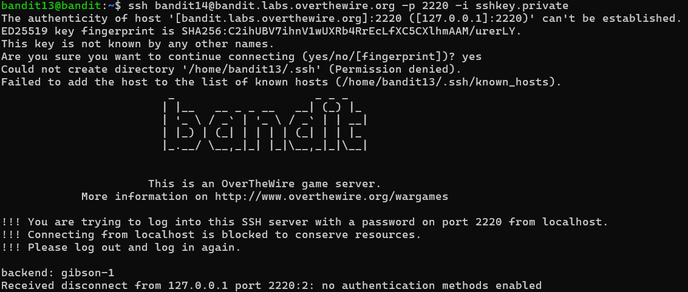
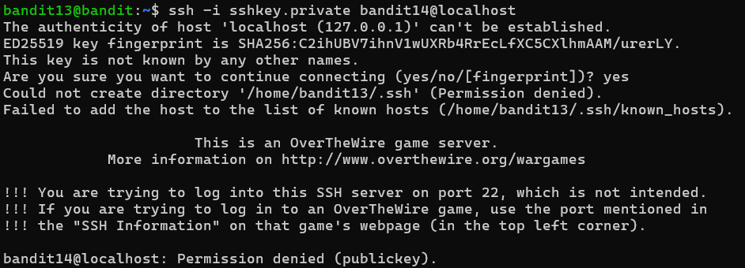
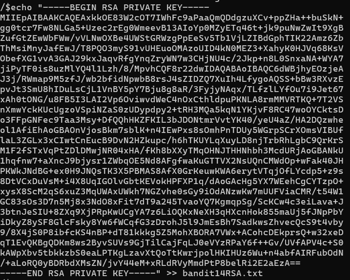
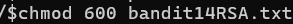
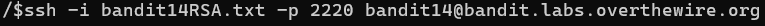

# OVERTHEWIRE-BANDIT13->14:

Username: bandit13

password: <Redacted>(obtain it from previous level)

#### Prerequisites:

**RSA key**: [info about RSA keys](https://en.wikipedia.org/wiki/RSA\_cryptosystem)

**ssh -i flag**: the -i flag allows you to use a key for your ssh, syntax is like -p

**chmod command**: This command allows you to change the permissions on a file depending on the number input. Syntax - chmod Num targetfile. For this level, we want 600 to be the number for the chmod. [Chmod number and what they represent](https://en.wikipedia.org/wiki/Chmod)

**exit command**: this command allows you to leave an ssh, or any other, connection

#### HINT:

Copy the RSA key to your own machine so that you don't have to connect to localhost

I would not waste much time on this level if you can't solve it, because you most likely know how, but you are making problems in syntax or small problems in command order.

\#### Solving the level: 

Let us try using the ssh key with -i to log in (two screenshots for either localhost or bandit.labs.overthewire.org)

 

ok, well, that didn't work because of local host connection, so let us take this into our own machine. cat the RSA key and copy it completely, then use exit. Then use echo with >> to a new file with any name. Then chmod the file to 600 and connect to the ssh.

finally, you can cat /etc/bandit_pass/bandit14 and get the password

Previous level: [Bandit12->13](../Bandit12/writeup.md.md)

Next Level: [Bandit14->15](../Bandit14/writeup.md.md)

