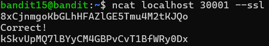

# OVERTHEWIRE-BANDIT15->16:

Username: bandit15

password: <Redacted>(obtain it from previous level)

#### Prerequisites:

**ncat command**: nc but better, same syntax as nc

**ncat --ssl flag**: encrypts output with an ssl connection

#### Solving the level: 

ncat to localhost port 30001 with --ssl flag:

Previous level: [Bandit14->15](../Bandit14/writeup.md.md)

Next Level: [Bandit16->17](../Bandit16/writeup.md.md)

