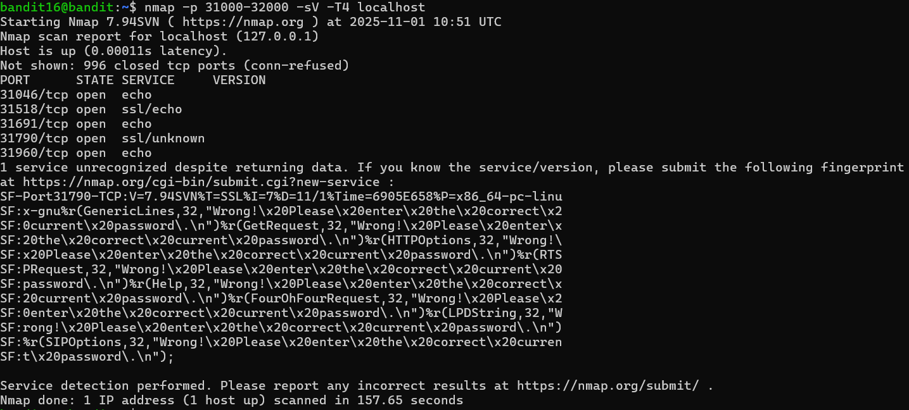
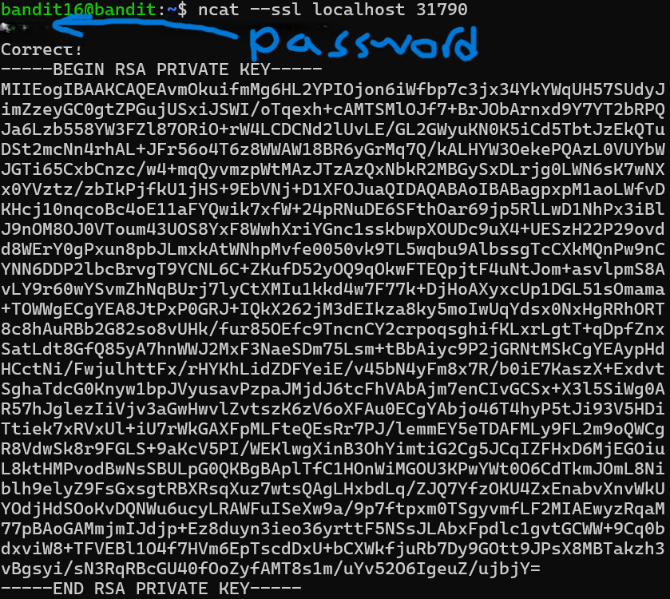

# OVERTHEWIRE-BANDIT16->17:

Username: bandit16

password: <Redacted>(obtain it from previous level)

#### Prerequisites:

**nmap command**: This is one of the most important commands in Linux, and in reality, it is a tool. It allows you to scan ports, websites, and everything in between for all servers and ports. 

Here is the official [nmap website](https://nmap.org/). If you want, you can use it to deeply research nmap, although you should gradually accumulate knowledge about it anyway.

syntax- nmap (flags) location of nmap

**nmap -p flag**: This flag allows nmap to operate on a port or range of ports. syntax- -p portnum OR -p portnum1-portnum2

**nmap -sV flag**: This stands for service version detection. It detects the version and service of the ports you request it to detect. Because it goes this deep, it usually takes a lot more time.

**nmap -T4 flag**: This flag is one of the six time setters for nmap. Below is a table from ChatGPT showing you what the speeds do. You can probably get away with using T5 as well

| Flag  | Name       | Behavior                         | Typical use                         |
| ----- | ---------- | -------------------------------- | ----------------------------------- |
| `-T0` | paranoid   | extremely slow, stealthy         | IDS evasion                         |
| `-T1` | sneaky     | slow                             | stealth scanning                    |
| `-T2` | polite     | moderate, low bandwidth use      | busy networks                       |
| `-T3` | normal     | default speed                    | safe default                        |
| `-T4` | aggressive | faster, assumes reliable network | local or low-latency scanning       |
| `-T5` | insane     | **very** fast, minimal wait      | testing, localhost, or lab use only |

#### Solving the level: 

We can start by using an nmap scan on localhost with the -p flag to set the port range, the -sV flag to see the services, and the -T4 flag to speed up the process. Using -sV means it will take a while, that's fine, but it should not take more than 5 minutes. It takes me 2-3 minutes.

Ok, so now we can look at the services given by the ports. Echo services mean they just return what you give them, so the only one we can try is the ssl/unknown, we can establish a connection with ncat and print the password

Now we can do the same steps we did in bandit13->14, we can copy the RSA key into a file on our own machine, chmod it to 600, connect to bandit17, and then cat /etc/bandit_pass/bandit17.

Previous level: [Bandit15->16](../Bandit15/writeup.md.md)

Next Level: [Bandit17->18](../Bandit17/writeup.md.md)

