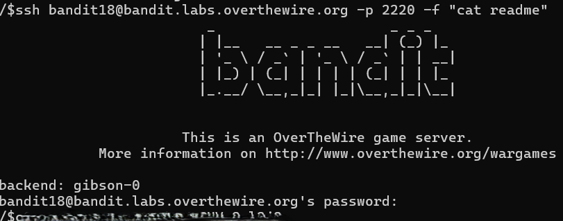

# OVERTHEWIRE-BANDIT18->19:

Username: bandit18

password: <Redacted>(obtain it from previous level)

#### Prerequisites:

**shells**: A shell is a terminal in which you can execute commands. You can check your shells on your system by catting /etc/shells.

**ssh -t flag**: The t flag forces the ssh connection into a pseudo-terminal, where you can execute commands.
Syntax- ssh -t "shell" address. 

Optional: I assume this is not intentional, and I could not find any other guides that use this method, but you could use the **ssh -f flag**: This flag creates a fork, which runs a command before the connection can run any commands. Syntax- ssh -f "command" address

#### Solving the level: 

Let us try logging into the level. At the end of the login, we can see that we get logged out.

Let us see the other shells on our system that we can log in to.

Now, let us use that with the -t flag to log in to the terminal.

#### Non-intentionally solving the level:

Let us fork the server and use the -f flag with ssh.

Previous level: [Bandit17->18](../Bandit17/writeup.md.md)

Next Level: [Bandit19->20](../Bandit19/writeup.md.md)

