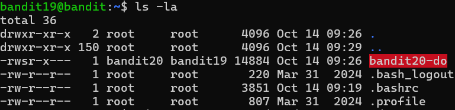

# OVERTHEWIRE-BANDIT19->20:

Username: bandit19

password: <Redacted>(obtain it from previous level)

#### Prerequisites:

**setuid**: This command allows you to take a file with setuid permissions and use it to run a command with the authority of that file. Syntax- dirlocation/setuidfilename command Ex: ./hi echo "I like bananas" More info: [Wikipedia.com](https://en.wikipedia.org/wiki/Setuid)

If you don't really care about understanding this deeply, but want to know if you can use it, use ls -la, and in the first column, you can see the permissions. Ex: drwxr-xr-x, you can know if it's setuidable if it has a lowercase s in the 4th slot:-rwsr-x--- 

#### Solving the level: 

We log in to the level and ls -la, we can see there is a file with setuid permissions, and conveniently, it is highlighted in red (overthewire/ubuntu feature). 

Now we can use it to cat the bandit pass:

Previous level: [Bandit18->19](../Bandit18/writeup.md.md)

Next Level: [Bandit20->21](../Bandit20/writeup.md.md)

