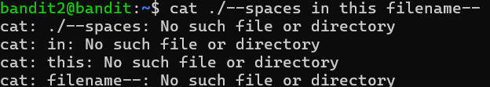

# OVERTHEWIRE-BANDIT2->3:

Username: bandit2

password: <Redacted>(obtain it from previous level)

#### Prerequisites:

**literal paths**: if you have a space in a path, it will be registered as two separate paths. To solve this, use double quotations ("") to surround the path.

#### Solving the level: 

Let's log in and use ls -la to find the file. I will try using cat with ./ because it has a hyphen, and it will register as a stdin:

It registered as many separate files because of the space, and it couldn't find any of the files. Now just surround the path with quotations and cat to get the password(the ./ should not be surrounded with quotations: cat ./"filename").

Previous level: [Bandit1->2](../Bandit1/writeup.md.md)

Next Level: [Bandit3->4](../Bandit3/writeup.md.md)

