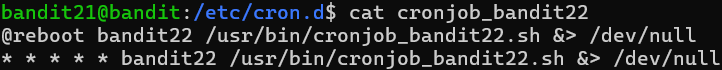
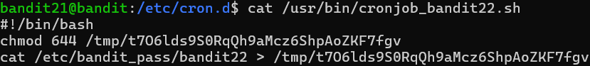

# OVERTHEWIRE-BANDIT21->22:

Username: bandit21

password: <Redacted>(obtain it from previous level)

#### Prerequisites:

\&>: is the same as >

**/dev/null/**: This folder is just a trash can.

#### Solving the level: 

The level tells us we should go to /etc/cron.d/. Let us go there. Let us cat the bandit22 cronjob and see what it does.

We can see that at reboot, the program sends a .sh file to /dev/null/, let's see what that file does.

we can see that it cats the password for the next level and send it to a file in the /tmp directory. We can cat that file with the fill path for the password

Previous level: [Bandit20->21](../Bandit20/writeup.md.md)

Next Level: [Bandit22-23>](../Bandit22/writeup.md.md)

