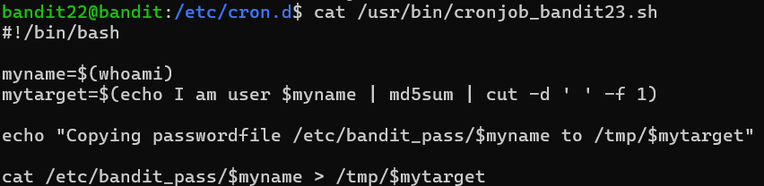
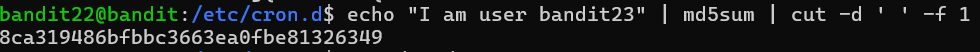

# OVERTHEWIRE-BANDIT22->23:

Username: bandit22

password: <Redacted>(obtain it from previous level)

#### Prerequisites:

**whoami command**: This command prints out which user you are. 

**md5sum command**:  This command creates a hexadecimal string that is 32 characters long and unique for each input. Syntax- md5sum string

**cut command**: this command is used to take parts of a string based on a delimiter(deciding character/characters). cut delimiter (other flags) string

**cut -d flag**: This flag is used to set the delimiter. Syntax- cut -d delimiter.

**cut -f flag**: this flag is set with either 1 or 2, and it determines one of two fields. The 1 field makes it take everything before the delimiter, while the 2 field makes it take everything after.

**$ operator**: This operator allows you to access a previously declared variable. Syntax- $variableName

#### Solving the level: 

Ok, so we follow the same file as last time, let's see what the program does:

We don't actually have to understand what the commands are to execute and replicate them. We add one to the whoami to get the password for the next level:

Now we can cat /tmp at the address of $mytarget(we figured out what mytarget is with the output of the previous step)

####Important note:

You can also cat the password for bandit24 in this level. This is probably a "reward for the curious." I would still, as always, recommend doing the next level so that you can learn from it.

Previous level: [Bandit21->22](../Bandit21/writeup.md.md)

Next Level: [Bandit23->24](../Bandit23/writeup.md.md)

