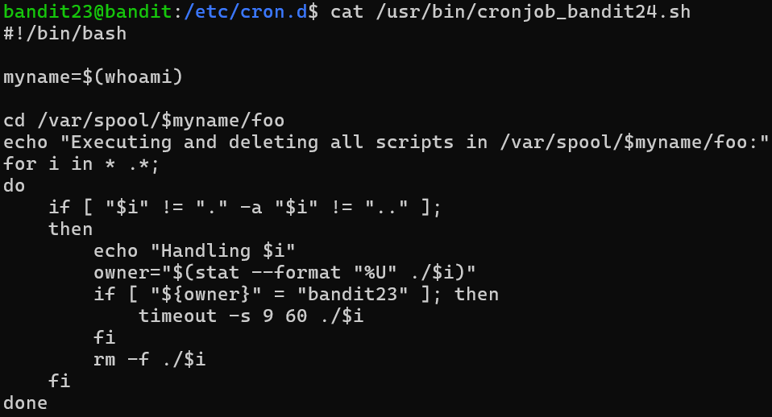
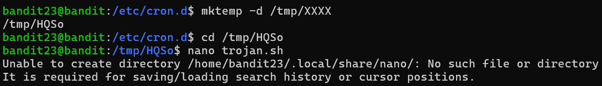
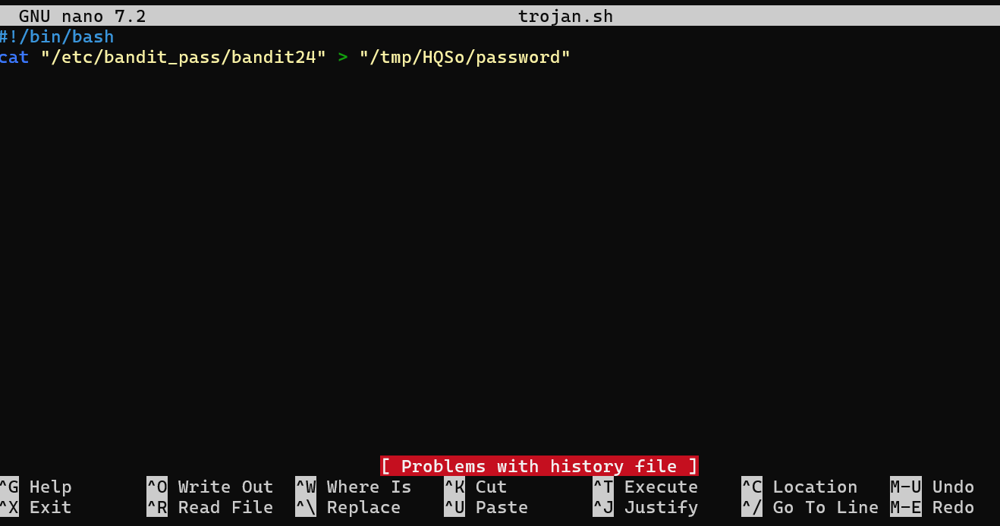
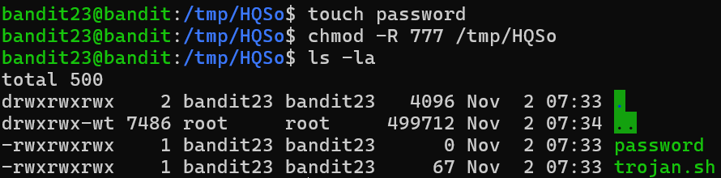
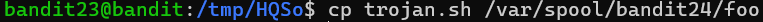
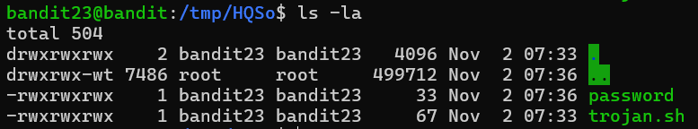

# OVERTHEWIRE-BANDIT23->24:

Username: bandit23

password: <Redacted>(obtain it from previous level)

#### Prerequisites:

**nano command**: This command allows editing a script. A bash script filename should end with a .sh, and the script itself should begin with a #!/bin/bash. To save the script with nano, use the Ctrl-S shortcut, and to exit is use the Ctrl-X shortcut. Syntax- nano filename

**stat command**: This command allows you to access stats about a file. Syntax- stat filename

**stat --format flag**: the --format flag allows you to access what specific info you want from the file. For this level, you need to know the %U specifier, which indicates the user who owns the file.

**chmod -R flag**: Makes chmod recursive(if applied to a directory it also affects all the file and directories inside)

**chmod 777 modifier**: changes permissions to make most of them accessible, needs to be used to allow scripts to run a file.

** \* operator **: The asterisk in bashscript and many other languages means all, so "for i in *dirname" means for every item i in the directory called dirname.

**timeout command**: determines the time a script can run. Syntax- timeout time(seconds) (flags) scriptname

**timeout -s 9 flag**: This flag sends a signal to the timeout command. Signal 9 means it is telling the timeout to kill the script when it goes over the time limit.

#### Solving the level: 

Okay, let's follow the same steps as the last levels. Let us print the script and see what it does.

Ok, this script is pretty long, let's read it line by line:

1: #!/bin/bash, this is a standard shebang to start the script

2: A myname variable is declared with the naming being equal to whoami, since the owner is bandit24, we can use that instead of the variable.

3: The script is changing the directory to /var/spool/bandit24/foo

4: It is echoing that it will execute, then delete all scripts in /var/spool/bandit24/foo

5: for all items i in this directory, the .* also means this includes hidden files

6: do

7: if the file is not equal to . (this directory) and not equal to .. (the previous directory)

8: then

9: print handling file

10: The owner is equal to the user owner of the file $i

11: if the owner is equal to bandit23, then

12: The timeout command here makes the script run for 60 seconds. After 60 seconds, it kills the script.

13: closing the if

14: deleting the $i file

15: closing the if

16: closing the loop

So, what we can use is that this script executes any file we put in here with the user bandit24. We can use this to get the script to cat the bandit24 pass to a file. If we just let it cat it, it will be visible to user bandit24, but not to our user bandit23, so we need to cat it to a file. Let us make a temporary directory to make a script using nano. Make sure to add .sh to the end of the nano file.

The messages below the nano just mean that the nano file won't save to our machine or to the files in our home directory, but we don't really care about that. Below are the contents of the nano file:

For the nano file above, first of all, a shebang must be added to have the file run, then we must cat the password to a file in our /tmp dir. 

Next, we have to touch the password file(the bandit24 doesn't have access to our dir, so it can't make files). Then we need to chmod the directory, the nano file, and the password file so that the script by bandit24 can access them. You can do this manually, but it is a lot easier to chmod the directory with the -R flag to make it recursive. You can see now that directories are highlighted in green and files/scripts are written in green(Ubuntu/overthewire feature).

After that, we need to copy the script to the /var/spool/bandit24/foo directory so that it will be run

After 60 seconds of waiting, we can see that the password file has had a change in byte count. If we cat it now, it should have the password. If you wait more than two minutes and the password still isn't there, then you did something wrong earlier on.

Previous level: [Bandit22->23](../Bandit22/writeup.md.md)

Next Level: [Bandit24->25](../Bandit24/writeup.md.md)

