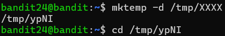
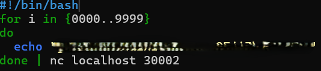
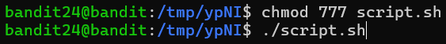

# OVERTHEWIRE-BANDIT24->25:

Username: bandit24

password: <Redacted>(obtain it from previous level)

#### Prerequisites:

**daemon**: A running background process that doesn't need direct user interaction

**piping with for loops**: if you want to pipe the output of a for loop, you can either have it inside the loop or at the end

#### Solving the level: 

Ok, so from the level we can see that we need to access port 30002 with nc and send the password with a four-digit combination, so let us make a temporary directory, so that we can make a script, because entering the same thing 10000 times would take too much time.

Now we can make a script, we use a for loop, and at the end pipe it to the connection. You may be thinking that this will print out one large string, and you are correct, but because of the new line automatically added every time you echo, each line will be registered into the connection separately. Now you can also put the connection at the end of the echo, but it seems that the overthewire website has blocked this feature to conserve resources.

Now we just have to chmod and run the file and we will get the password at the end.

Previous level: [Bandit23->24](../Bandit23/writeup.md.md)

Next Level: [Bandit25->26](../Bandit25/writeup.md.md)
