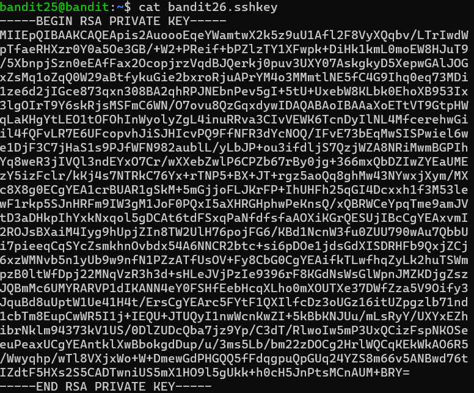
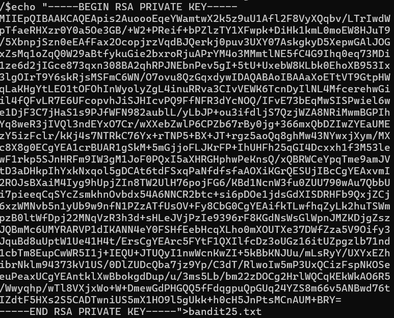
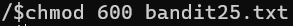

# OVERTHEWIRE-BANDIT25->26:

Username: bandit25

password: <Redacted>(obtain it from previous level)

#### Prerequisites:

Nothing...

#### Solving the level: 

This level is just a precursor to the next one, we log in and see an SSH key, cat it

echo it to a file and chmod it

Previous level: [Bandit24->25](../Bandit24/writeup.md.md)

Next Level: [Bandit26->27](../Bandit26/writeup.md.md)