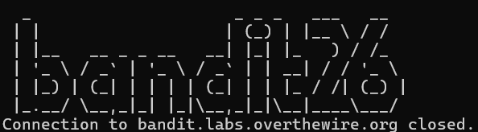
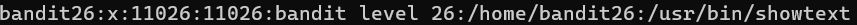
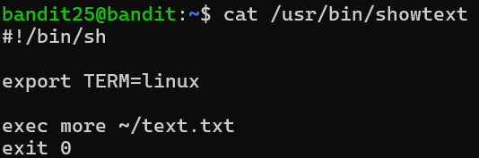
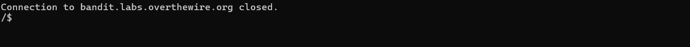
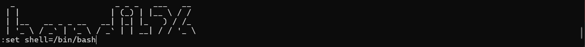
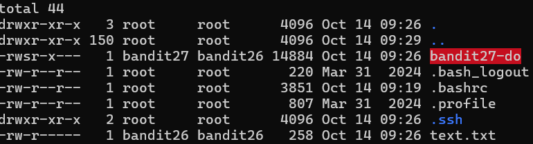
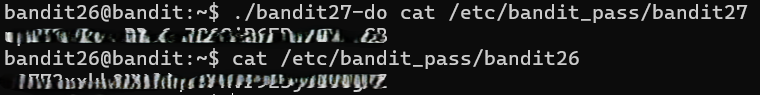

# OVERTHEWIRE-BANDIT26->27:

Username: bandit26

password: <Redacted>(obtain it from previous level)

#### Prerequisites:

**/etc/passwd directory**: All Linux systems have this directory, and it displays a lot of information about the different users, such as the shell used.

**more view mode**: The more view mode allows you to view a text file by scrolling up and down if your window is too small to contain all the information. If it's opened in its default mode, then it's called normal view mode.

**Vim editor**: The Vim editor is a tool that makes changing text easy and efficient. To go into the Vim editor from the normal view mode, press the v button.

**:set vim command**: The :set command allows you to assign a variable a value. For this level, you need to set the shell to a value. The most common shell is /bin/bash. Syntax-:set variable=value

**:shell vim command**: The :shell command allows you to open the shell from within the vim editor.

#### Solving the level: 

Let us try logging in using the ssh key from the previous level.

Well, we got logged out, let us log into bandit25 and see what shell is being used. If we cat /etc/passwd and find bandit26, we can see the shell it's using and cat it

We can see that the text file is using more. We can use this to our advantage by making our window smaller so that we can access the Vim editor before we get logged out. Literally squish your window.

After we make the window smaller, we log in and press "v" on the keyboard to open the Vim editor. Then we can set the shell to /bin/bash. After that, you need to open the shell.

Now that we have a shell, the rest of this level is easy. We use ls -la and see that we have a setuid file for bandit27

Now we can cat the bandit pass for bandit27, and while we are here, we can do the same for bandit26.

Previous level: [Bandit25->26](../Bandit25/writeup.md.md)

Next Level: [Bandit27->28](../Bandit27/writeup.md.md)

