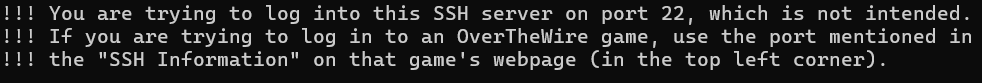
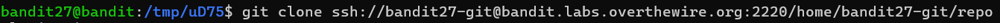
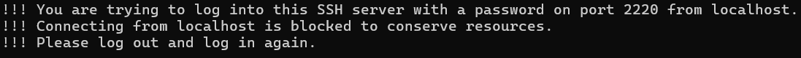
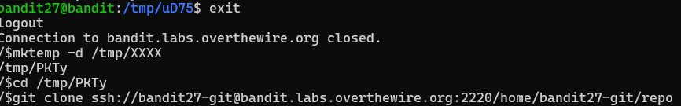
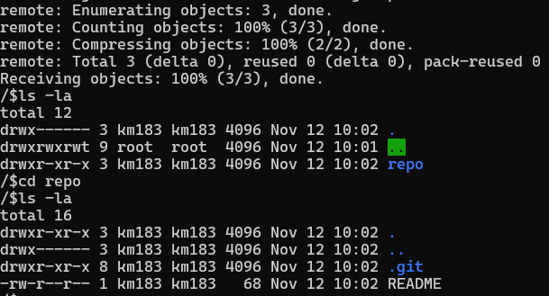

# OVERTHEWIRE-BANDIT27->28:

Username: bandit27

password: <Redacted>(obtain it from previous level)

#### Prerequisites:

**git**: Basically allows you to make projects with others and collaborate on them, but there is a lot more to learn. Check this [website](https://git-scm.com/) for more.

**git command**: Allows you to interact with git files in many different ways.

**git-clone configuration**: Allows you to clone a git repository.

#### Solving the level: 

So let us log into Bandit27. The level wants us to clone the repository(basically a folder) from a git address, so let us make a temporary directory to clone the repository into. Then, let us run the git command with the clone configuration.(Btw, if you put in @localhost instead of @bandit.labs.overthewire.org, that is more correct, but it doesn't matter as we will have another problem in a bit)

We can see an error because we tried connecting to the default port. Let us specify it with : 

Now we see another problem. Most other guides are outdated and don't cover this, but you cannot connect from localhost, so you must leave the overTheWire server and create a temporary directory on your own device. If you are worried about getting compromised(OverTheWire hacking your system), then you can use a VM, but I personally will be continuing on the Ubuntu application.

After downloading the repository, make your way through it and cat the readme.

Previous level: [Bandit26->27](../Bandit26/writeup.md.md)

Next Level: [Bandit28->29](../Bandit28/writeup.md.md)

