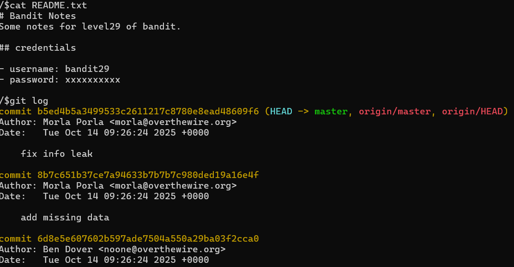
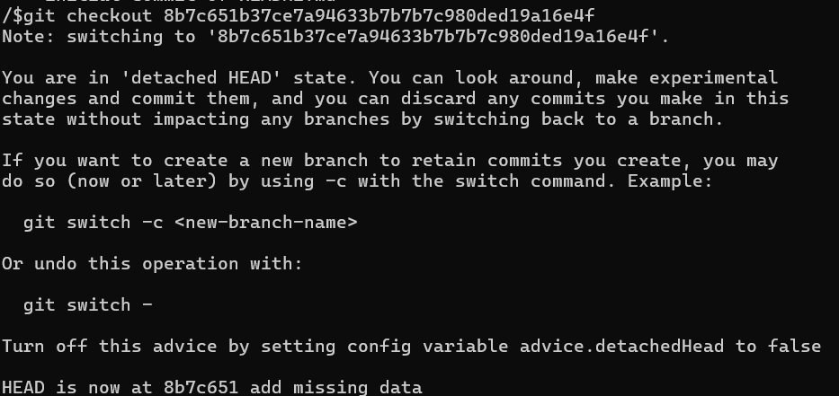

# OVERTHEWIRE-BANDIT28->29:

Username: bandit28

password: <Redacted>(obtain it from previous level)

#### Prerequisites:

**git-log**: allows you to check previous commits of a git file. (One of the main advantages of git is that you can access previous versions or "commits" of a folder.) Syntax- git log (while in repository)

**git-checkout**: allows you to go back to previous or future commits. Syntax- git checkout commitID

#### Solving the level: 

Follow the steps from the previous level to clone the git repository. Then we can cat the readme file. So there is a password, but it is replaced with x's. Let us check the previous logs to see if there are any versions where the password isn't hidden.

We can see the most recent commit fixes an "info leak", so most likely the previous version has the password leak. Checkout to the previous commit and then cat README.

Previous level: [Bandit27->28](../Bandit27/writeup.md.md)

Next Level: [Bandit29->30](../Bandit29/writeup.md.md)

