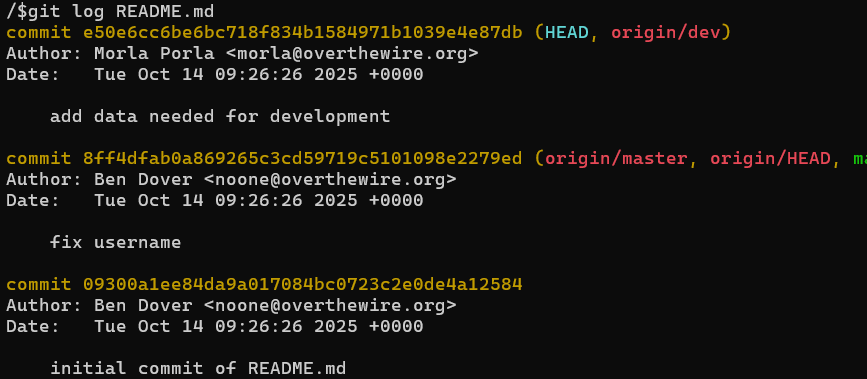

# OVERTHEWIRE-BANDIT29->30:

Username: bandit29

password: <Redacted>(obtain it from previous level)

#### Prerequisites:

**git branches**: Git branches are designed to provide a project with security by allowing contributors to work on their own branch and merge it to the main branch when it is ready and secure.

**git branch**: This command, when used with the -a flag, allows you to see all branches. Syntax- git branch -a

**git checkout**: used this last time to change the commit version, but you can also use it for changing branches.

#### Solving the level: 

So we clone the repository, navigate to README, and this time it says " <no passwords in production!>" From this, we receive a hint that it is most likely being produced in a different branch, so let us check the branches.

We see the dev branch, and we navigate to it (if you get an error saying you couldn't find any branches, that's because you didn't navigate to the repo directory). Now we can check the log and see if there are any different versions.

We can see there is a new commit that needs data for development. Change to that commit version and cat README to get the password.
 
Previous level: [Bandit28->29](../Bandit28/writeup.md.md)

Next Level: [Bandit30->31](../Bandit30/writeup.md.md)

