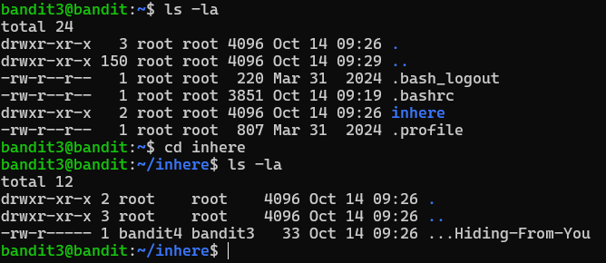

# OVERTHEWIRE-BANDIT3->4:

Username: bandit3

password: <Redacted>(obtain it from previous level)

#### Prerequisites: 

**cd command**: The cd command stands for change directory, which allows you to change your directory. Its syntax is cd directoryName.

#### Solving the level: 

After logging in, we use ls -la to look at the files and directories. We see the inhere directory, and so we do cd inhere and then ls -la again once we enter the new directory.

Since we used ls -la, the -a part allows us to see hidden files. Simply cat the hidden file and you will get the password.

Previous level: [Bandit2->3](../Bandit2/writeup.md.md)

Next Level: [Bandit4->5](../Bandit4/writeup.md.md)

