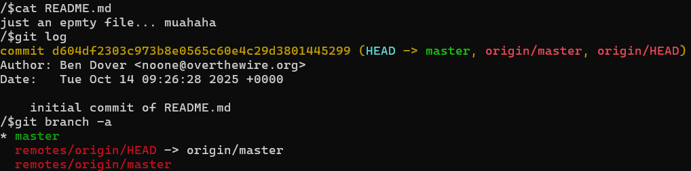
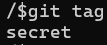
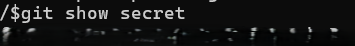

# OVERTHEWIRE-BANDIT30->31:

Username: bandit30

password: <Redacted>(obtain it from previous level)

#### Prerequisites:

**git tags**: git tags are like comments or bookmarks that are left in different commits.

**git tag command**: The git tag command allows you to view tags in the current commit. Syntax- git tag

**git show command**: This command allows you to view tags. Syntax- git show tagName

#### Solving the level: 

Let's clone the repository and cat README. No useful info. Let's check the log and other branches too, but again nothing useful.

Then let us check the tags.

Let us show the tag. After we do this, it will output the password

Previous level: [Bandit29->30](../Bandit29/writeup.md.md)

Next Level: [Bandit31->32](../Bandit31/writeup.md.md)

