# OVERTHEWIRE-BANDIT31->32:

Username: bandit31

password: <Redacted>(obtain it from previous level)

#### Prerequisites:

**git add command**: This command allows you to add files and file changes to the next commit. Usually, it is accompanied by ".", which means everything in this directory. Syntax- git add files/directories

**git commit command**: This command allows you to make a commit. It is usually followed by the -m flag, which allows you to add a message with your commit. Syntax- git commit -m "message"

**git push command**: This command allows you to push the changes in your commit to the next version of your branch. Syntax- git push

#### Solving the level: 

Let us clone the repository, navigate, and cat README.

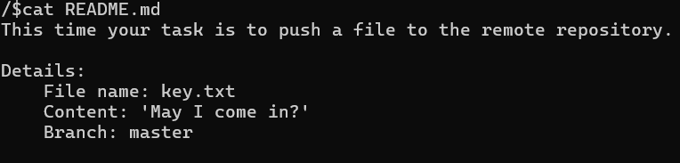

This time, we are required to push a file with certain properties, so let us try to do that.

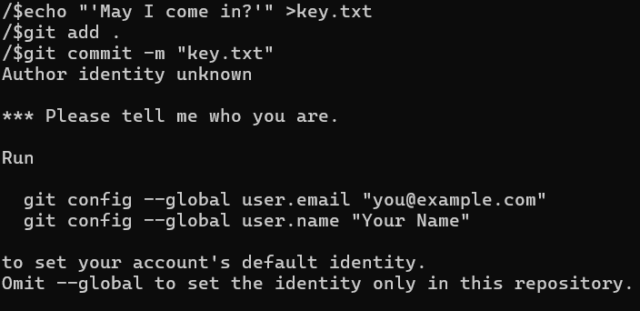

This part is what we can take from this error message:

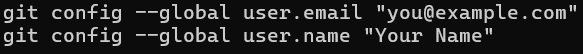

Basically, our email and username don't fit what the repository is looking for. We don't know what email and username we should use, but maybe they will be in level 31, so let us log into the actual server and ls -la.

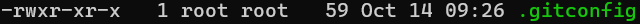
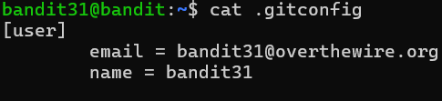

Now that we have the email and username, we can leave the server and set our email and password to the required email and password:

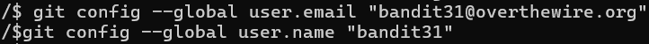

Ok, now let us try pushing again:

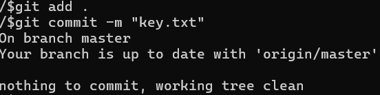

Strange, it is saying there is nothing to commit, let us ls -la to see what the problem could be. We can see there is a .gitignore file that ignores all text files, so let us get rid of it.

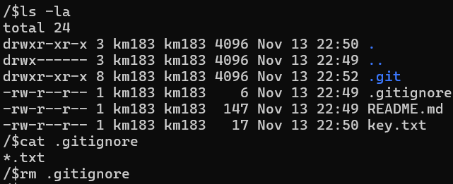

Ok, now let us try again.

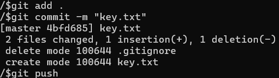

An error? The content of the file is wrong because I included the parentheses with the 'May I come in?', so let us fix that. If you made this mistake, don't worry about it; it's just a simple misinterpretation of the task.

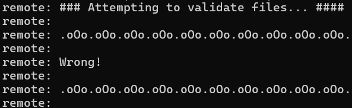
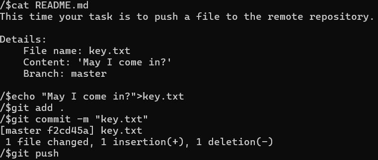
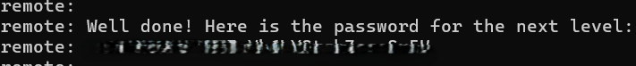

Previous level: [Bandit30->31](../Bandit30/writeup.md.md)

Next Level: [Bandit32->33](../Bandit32/writeup.md.md)

