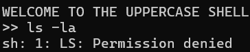
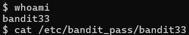

# OVERTHEWIRE-BANDIT32->33:

Username: bandit32

password: <Redacted>(obtain it from previous level)

#### Prerequisites:

**$0**: The $0 is a special variable in Linux. It points to the base shell in any terminal, and if executed on its own, it will take the user to that shell.

#### Solving the level: 

So we log into the level and it says it's an "UPPERCASE SHELL". It's pretty obvious what this will do, but let us try ls -la.

As expected, anything we write is capitalized. Let us use the special variable $0 to go back to the normal shell instead of the UPPERCASE one.

After using ls -la, we can see that the owner of the UPPERCASE in bandit33, so since we went to the normal shell, our user should be bandit33. 

whoami confirms this, and then we can cat the banditpass.

Previous level: [Bandit31->32](../Bandit31/writeup.md.md)

Next Level: [Bandit33->34](../Bandit33/writeup.md.md)

