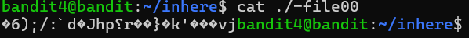

# OVERTHEWIRE-BANDIT4->5:

Username: bandit4

password: <Redacted>(obtain it from previous level)

#### Prerequisites: 

Optional: reset command: resets your terminal and makes it neat

#### Solving the level: 

Like the previous level, navigate to the inhere directory and ls -la. The description on the website the password is in the only human-readable file. Let us try catting one of the files(using ./ because of the -). 

The message is unintelligible because it is mainly in machine code. In a small sample size like this, we can separately cat every file until we get one that we can understand. Later on, if there is a larger sample, this will be done in a script. Cat every file until you find the password.

Previous level: [Bandit2->3](../Bandit2/writeup.md.md)

Next Level: [Bandit4->5](../Bandit4/writeup.md.md)

