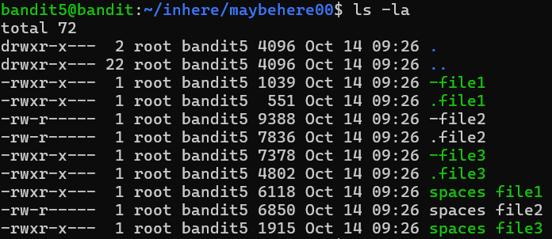
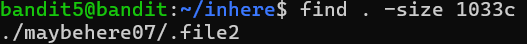

# OVERTHEWIRE-BANDIT5->6:

Username: bandit5

password: <Redacted>(obtain it from previous level)

#### Prerequisites:

find command: The find command allows you to find a file or directory, and its flags make it find a file based on different attributes.

[website with different flags](https://man7.org/linux/man-pages/man1/find.1.html)

Ones that matter for this level:

-executable: to check if the file is executable(although this command only finds files executable to our user so using it wont work, although its good to know about)

-size n: to specify the size of the file (add a c exactly to the right of the number to specify that it's in bytes)

syntax: find (directory name) (flags)

#### Solving the level: 

Navigate to the Inhere directory and ls -la. We can see there are many directories, let's go to any one of them and use ls -la in it. 

We can see that there are a lot of files in the directory. If we were to go through every file looking for the requirements specified on the website, it would take a while. Let us use the find command. We will not use the executable flag because, as mentioned earlier, it requires us to be able to execute it, not for it to just be executable in general.

Now we just have to cat that file and we will get the password(for the cat, add the full path for ease).

Previous level: [Bandit4->5](../Bandit4/writeup.md.md)

Next Level: [Bandit6->7](../Bandit6/writeup.md.md)

