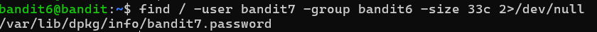

# OVERTHEWIRE-BANDIT6->7:

Username: bandit6

password: <Redacted>(obtain it from previous level)

#### Prerequisites:

find flags: [website](https://man7.org/linux/man-pages/man1/find.1.html)

-user *Username*: to find a file with a certain user owner

-group *Groupname*: to find a file with a certain group owner

/: refers to the root directory in Linux.

#### Solving the level: 

Using the parameters given to us from the website, we can run find to get a file containing the password.

Then we can cat the file path to get the password

Previous level: [Bandit5->6](../Bandit5/writeup.md.md)

Next Level: [Bandit7->8](../Bandit7/writeup.md.md)

