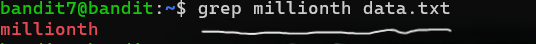

# OVERTHEWIRE-BANDIT7->8:

Username: bandit7

password: <Redacted>(obtain it from previous level)

#### Prerequisites:

**grep command**: used to search for specific words or "patterns".

syntax - grep pattern filename 

#### Solving the level: 

The website indicates that there is a password next to 'millionth' in data.txt. If we cat data.txt and try to look for millionth, we can see that there are way too many words and the terminal can't render them all at the same time, so we must use grep.

Previous level: [Bandit6->7](../Bandit6/writeup.md.md)

Next Level: [Bandit8->9](../Bandit8/writeup.md.md)

