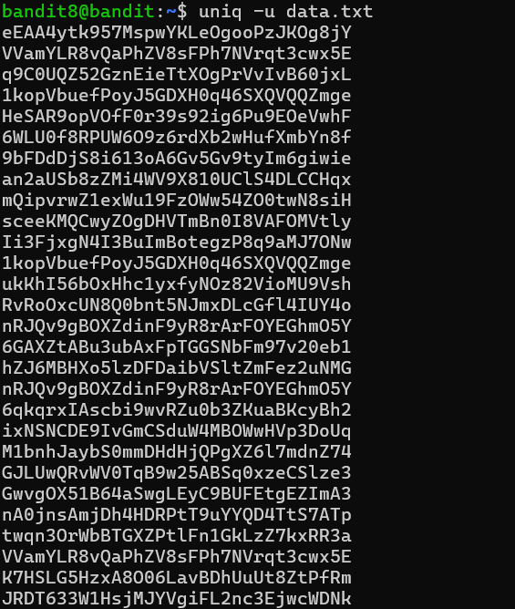
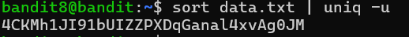

# OVERTHEWIRE-BANDIT8->9:

Username: bandit8

password: <Redacted>(obtain it from previous level)

#### Prerequisites:

uniq command: filters out repeated lines in a file if they are adjacent

flags: -u, print unique lines

syntax - uniq (flag) filename

sort command: sorts by alphabetical order

Piping: linking the output of one command to another, this technique can take some time to get used to. Basically, let's say I want to sort a file, then grep it(this is an unrealistic example, but that's fine), I could either make a file and save the output of the sort to it, or I could simply use piping. The syntax is simply using the | operator, so for the previous example, you would do **sort targetfile | grep targetword** (the pipe works only on the output, so you do not need to reference the same file twice)

#### Solving the level:

Similar to the previous level, if we cat, there are too many lines to go through, so we will use the uniq command. Let's try using it with the -u flag

It doesn't seem like it filtered anything. This is because we need to have the duplicate sentences be adjacent, so let's sort and use a pipe to uniq it after.

Previous level: [Bandit7->8](../Bandit7/writeup.md.md)

Next Level: [Bandit9->10](../Bandit9/writeup.md.md)

