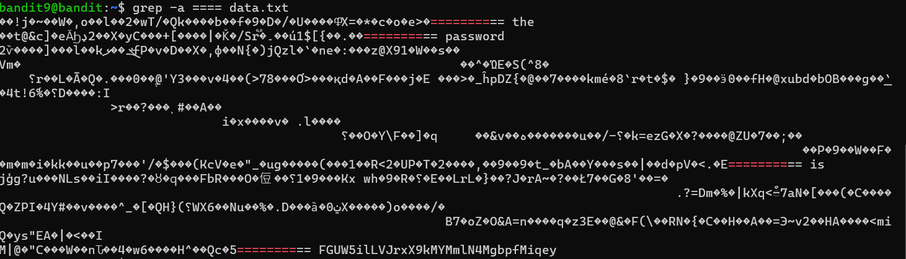

# OVERTHEWIRE-BANDIT9->10:

Username: bandit9

password: <Redacted>(obtain it from previous level)

#### Prerequisites:

**grep -a flag**: this flag allows grep to be used on binary files(machine code files)

#### Solving the level: 

simply use grep with the dash followed by "several" equal signs. Let's just put any number, say 4

We can see that the text parts we find make a sentence that says: "the password is ----------"

Previous level: [Bandit8->9](../Bandit8/writeup.md.md)

Next Level: [Bandit10->11](../Bandit10/writeup.md.md)

